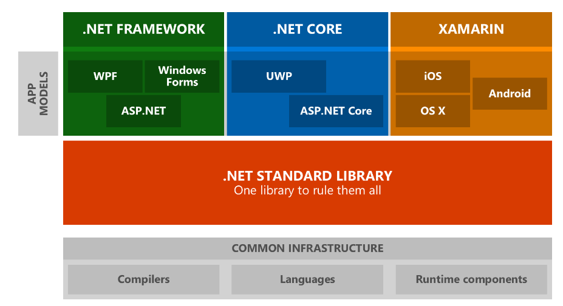

# WiM.Standard

WiM.Standard is a collection of custom reusable .NET Standard libraries and objects available on nuget for handling logging, requests, hypermedia and timeseries

### Installing

comming soon -> push to nuget repo list

[WIM.Analytics NuGet package](https://www.nuget.org/packages/WiM.Analytics/):`Install-Package WiM.Analytics`

[WIM.DBUtilities NuGet package](https://www.nuget.org/packages/WiM.DBUtilities /):`Install-Package WiM.DBUtilities`

[WIM.Extensions NuGet package](https://www.nuget.org/packages/WiM.Extensions/):`Install-Package WiM.Extensions`

[WIM.Hypermedia NuGet package](https://www.nuget.org/packages/WiM.Hypermedia/):`Install-Package WiM.Hypermedia`

[WIM.TimeSeries NuGet package](https://www.nuget.org/packages/WiM.Resource.TimeSeries/):`Install-Package WiM.Resource.TimeSeries`

[WIM.Resources NuGet package](https://www.nuget.org/packages/WiM.Resources/):`Install-Package WiM.Resources`

[WIM.Security NuGet package](https://www.nuget.org/packages/WiM.Security/):`Install-Package WiM.Security`

[WIM.Services NuGet package](https://www.nuget.org/packages/WiM.Services/):`Install-Package WiM.Services`

[WIM.Spatial NuGet package](https://www.nuget.org/packages/WiM.Spatial/):`Install-Package WiM.Spatial`

[WIM.Utilities NuGet package](https://www.nuget.org/packages/WiM.Utilities/):`Install-Package WiM.Utilities`

[WIM.ServiceAgent NuGet package](https://www.nuget.org/packages/WiM.Utilities.ServiceAgent/):`Install-Package WiM.Utilities.ServiceAgent`

## Built With

* [Dotnet Standard 2.0](https://docs.microsoft.com/en-us/dotnet/standard/net-standard)

## Contributing

Please read [CONTRIBUTING.md](CONTRIBUTING.md) for details on the process for submitting pull requests to us. Please read [CODE_OF_CONDUCT.md](CODE_OF_CONDUCT.md) for details on adhering by the [USGS Code of Scientific Conduct](https://www2.usgs.gov/fsp/fsp_code_of_scientific_conduct.asp).

## Versioning

We use [SemVer](http://semver.org/) for versioning. For the versions available, see the [tags on this repository](../../tags). 

Advance the version when adding features, fixing bugs or making minor enhancement. Follow semver principles. To add tag in git, type git tag v{major}.{minor}.{patch}. Example: git tag v2.0.5

To push tags to remote origin: `git push origin --tags`

*Note that your alias for the remote origin may differ.

## Authors

* **[Jeremy Newson](https://www.usgs.gov/staff-profiles/jeremy-k-newson)**  - *Lead Developer* - [USGS Web Informatics & Mapping](https://wim.usgs.gov/)

See also the list of [contributors](../../graphs/contributors) who participated in this project.

## License

This project is licensed under the Creative Commons CC0 1.0 Universal License - see the [LICENSE.md](LICENSE.md) file for details

## Suggested Citation

In the spirit of open source, please cite any re-use of the source code stored in this repository. Below is the suggested citation:

`This project contains code produced by the Web Informatics and Mapping (WIM) team at the United States Geological Survey (USGS). As a work of the United States Government, this project is in the public domain within the United States. https://wim.usgs.gov`

## About WIM

* This project authored by the [USGS WIM team](https://wim.usgs.gov)
* WIM is a team of developers and technologists who build and manage tools, software, web services, and databases to support USGS science and other federal government cooperators.
* WiM is a part of the [Upper Midwest Water Science Center](https://www.usgs.gov/centers/wisconsin-water-science-center).
